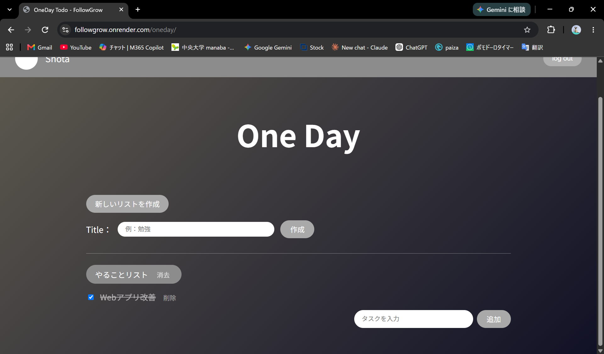
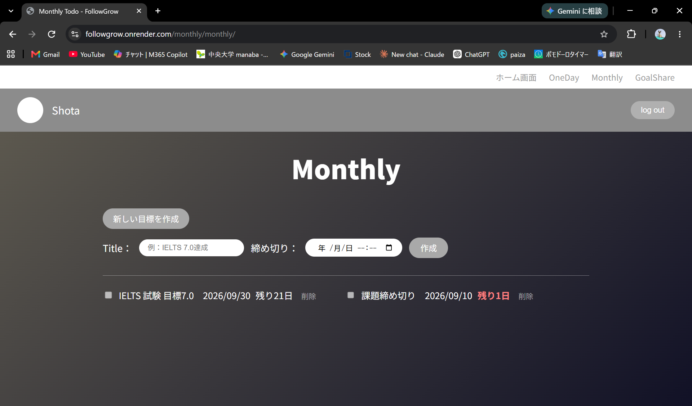
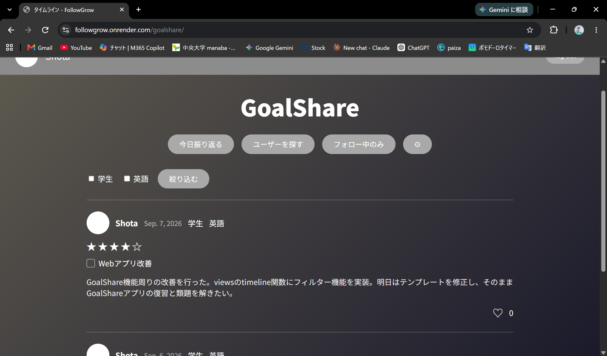
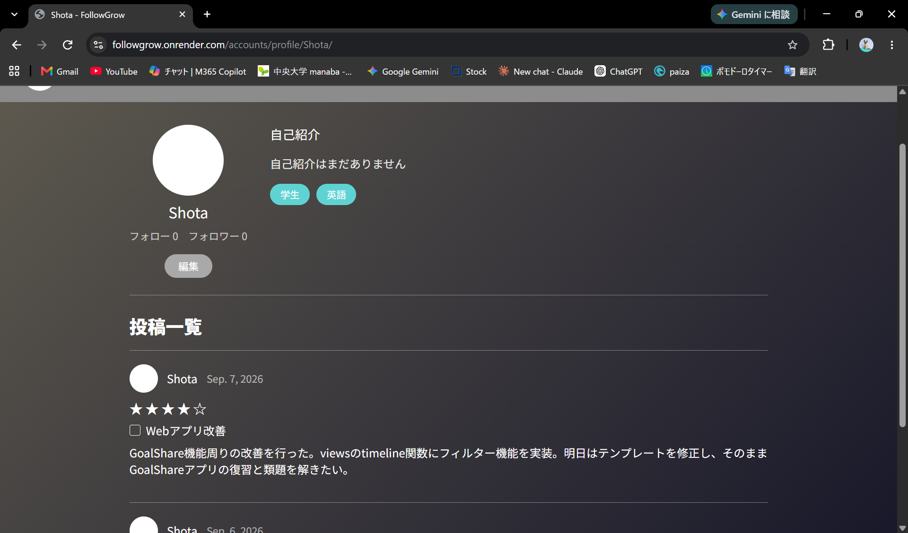

# FollowGrow　
https://followgrow.onrender.com/
FollowGrowは、自分のToDoをほかの人と共有し、目標へのモチベーションを維持するためのWebアプリです。

### ネーミングの由来

「FollowGrow」という名前には、自分と同じような目標を持つ人が成長していく様子を追いかける、という意味を込めています。また、命名の際には中央大学・飯田朝子先生の授業をとった際に「人の心をつかむキャッチコピーを作りたいのなら言葉の響きやスペルに共通性があるとよい」と教わったことを思い出しこの名前をつけました。

---

## 目次

- [概要](#概要)
- [課題設定](#課題設定)
- [ターゲット層](#ターゲット層)
- [要件定義](#要件定義)
- [技術選定理由](#技術選定理由)
- [モデル設計](#モデル設計)
- [機能一覧](#機能一覧)
- [UI/UX](#uiux)
- [セキュリティ](#セキュリティ)
- [改善履歴](#改善履歴)
- [AI活用履歴](#ai活用履歴)
- [今後の展望](#今後の展望)

---

## 概要

FollowGrowは、「継続できるToDoアプリ」です。ただToDoリストを作るだけでなく、それを他のユーザーと共有し、他の人が一日にどんなToDoをこなしたかを見られるようにすることで、一人では続けにくい目標達成へのモチベーションを維持できるようにしています。

既存のToDoアプリや勉強記録アプリと異なる点は、主に以下の2つです。

1. **ToDoリストそのものを共有できること**：自分と似た目標を持つ人が、一日に何を頑張ったかを見ることができ、頑張りをお互いに共有できます。
2. **あくまでも一日にやることの整理とShareに特化している**：既存の勉強記録アプリは、勉強時間や科目の記録が中心であり、タイムラインには大量の学習ログが流れてきます。FollowGrowでは、あくまで「その日行ったToDo」だけを共有するため、あるユーザーが取り組んでいることの全体像を一目で把握できます。

## 課題設定

- 既存のToDoアプリは、一人で使い続けるうちにモチベーションを維持しづらい。
- 既存の勉強アプリでは「今日勉強を終えたもの」自体を投稿するだけのものが主であり『一日にやるべきことの整理』に焦点を当てたものはまだ少ない。
- 既存の勉強記録アプリは「時間の記録」が主目的になりがちで、日々何をやったかという全体像が見えにくい。
- 既存の勉強記録アプリのタイムラインは、フォローしている人のみ、同じ大学の人のみ、同じ資格を目指す人のみ、など表示範囲が限定的になりやすい。

## ターゲット層

- 大学生
- 社会人

既存の勉強記録アプリの多くは大学受験生向けに特化しているため、あえてターゲット層を大学生・社会人に絞り、それぞれに合った機能を実装する方針としました。

## 要件定義

### MVPをOneDay Todoに絞った理由

Webアプリ開発、およびDjangoの利用は今回が初めてでした。そのため、まずOneDay Todoの制作を通じて開発の一連の流れ(環境構築からモデル設計、View、Template)を理解した上で、Monthly ToDoやGoalShareを含めた全体の開発を進める方針としました。

### 実装した機能(MVP後の完成形)

- OneDay Todo(その日のタスク管理)
- Monthly Todo(締め切り付きの目標管理)
- GoalShare(一日の振り返り投稿・タイムライン・フォロー・いいね・タグによる類似ユーザー発見)
- ユーザー認証・プロフィール機能

## 技術選定理由

### Python


- はじめて勉強したバックエンド言語であり現在も学習中のものであるため、新たに現在web開発において主流なバックエンド言語の学習を始めるよりも開発そのものに時間を割きたいと考えたから。また情報量が多く、学習時のトラブルシューティングがしやすい
- 文法がシンプルで、ロジックや設計そのものに集中できる

### Django

- 他フレームワークのFlaskと比較したとき、Djangoには認証機能、管理画面、ORMが標準で組み込まれており、今回実装したSNS機能と相性がよくDjangoのほうがより独自機能の実装に集中できると考えたから。

### DB(SQLite → Renderでのデプロイ時にPostgreSQLへ移行)

- MVP開発時点ではSQLiteを採用。追加のセットアップが不要で、開発速度を優先できるから
- デプロイ時にPostgreSQLへの移行。無料で利用することができるためコストを抑えられるから。

## モデル設計

```
User (Django標準)
 ├─ Profile (1対1)
 │    ├─ avatar (アイコン画像)
 │    ├─ bio (自己紹介)
 │    └─ tags (Tagとの多対多)
 │
 ├─ OneDayList (1対多)
 │    └─ OneDayTask (1対多)
 │         └─ completed_at (完了日時、GoalShareとの連携に使用)
 │
 ├─ MonthlyList (1対多)
 │    └─ deadline / days_remaining (締め切り・残り日数)
 │
 ├─ DailyReflection (1対多)
 │    ├─ rating (5段階評価)
 │    ├─ comment (振り返りコメント)
 │    ├─ completed_tasks_snapshot (投稿時点の完了タスクを保存)
 │    └─ Like (DailyReflectionとUserの中間モデル)
 │
 └─ Follow (User同士の自己参照関係)
      ├─ follower (フォローする側)
      └─ following (フォローされる側)
```

### 設計上のポイント

**OneDayTaskへのcompleted_atの追加**
GoalShareの投稿は「その日完了したタスク」を自動取得する仕様のため、いつ完了したかを判定できる`completed_at`フィールドを追加しました。

**DailyReflectionのcompleted_tasks_snapshot**
投稿時点で完了していたタスクの内容を、テキストとして保存(スナップショット化)しています。OneDay_todo側のタスクは後から編集・削除される可能性があるため、投稿後に元データが変化しても、過去の振り返り内容が変わらないようにするための設計判断です。

**Followモデルを中間モデルとして独立させた理由**
Django標準の`ManyToManyField`だけでも多対多関係は表現できますが、「いつフォローしたか」という付随情報を持たせたかったため、あえて独立したモデルとして設計しました。現在はこの情報を使う機能を実装していませんが、今後フォロー通知機能などを実装することを想定し予め実装しました。

**Tagモデルとの多対多関係**
ユーザーの属性(学生・社会人など)や目標領域(IT・語学など)を、単一の選択式フィールドではなく、複数選択可能なタグとして設計しました。理由は[改善履歴](#改善履歴)を参照してください。

## 機能一覧

- [x] OneDay Todo(タイトル作成・タスク追加・表示・削除・完了チェック)
- [x] Monthly Todo(目標作成・締め切り設定・残り日数の可視化・削除)
- [x] GoalShare(一日の振り返り投稿・星評価・コメント・完了タスクの自動反映)
- [x] タイムライン(フォローしている人、および共通タグを持つ人の投稿を表示)
- [x] フォロー / フォロー解除
- [x] いいね機能
- [x] ユーザープロフィール(アイコン・自己紹介・タグ設定・投稿一覧)
- [x] ユーザー検索
- [x] 認証機能(サインアップ・ログイン・ログアウト)

## UI/UX

- 全ページ共通のダークテーマ(グラデーション背景)を採用し、アプリ全体で世界観を統一
- 各画面の主要な見出しにフェードアップアニメーションを実装し、操作の起点にメリハりを持たせた
- 共通ヘッダー(`base.html`)を導入し、ユーザーアイコン・ユーザー名・ログアウト・各アプリへのナビゲーションを全ページで共通化
- タグはピル型のバッジ表示にすることで、視覚的に把握しやすくした

###　実際の画面







## セキュリティ

- **CSRF対策**：全てのPOSTフォームに``を設置し、CSRF攻撃を防止
- **アクセス制御**：`get_object_or_404`にログインユーザー自身の条件(`user=request.user`)を必ず加えることで、URLのIDを書き換えても他人のデータを閲覧・操作できないようにした
- **認証必須ページの保護**：主要なview関数に`@login_required`を設定し、未ログイン状態でのアクセスを防止
- **パスワードの保護**：Django標準の`UserCreationForm`を利用し、パスワードをハッシュ化した状態でDBに保存
- **ファイルアップロードの制限**：プロフィールアイコンは`ImageField`を使用し、画像形式のバリデーションを行っている

## 改善履歴

開発を進める中で、当初の設計から複数回の見直しを行いました。

### 1. タイトル画面の独立とナビゲーションの追加

当初はOneDay TodoにHome機能を持たせていましたが、Monthly ToDo・GoalShareを含めた全体設計を進める中で、3つのアプリへアクセスできるタイトル画面を独立させ、共通ヘッダー・ナビゲーションを追加しました。


### 2. GoalShareにおけるタスクのスナップショット化

振り返り投稿時に「その日完了したタスク」をテキストとして保存する設計とし、OneDay_todo側のデータが後から変更・削除されても、過去の投稿内容が影響を受けないようにしました。

### 3. コミュニティ機能からタグ機能への設計転換

**当初の構想**：Community(グループ)モデルを作成し、ユーザーがグループに参加することで同じ目標を持つ人同士がつながれる機能を想定していました。

**方針転換の理由**：グループの作成・参加・退出・権限管理などは実装コストが高く、開発スケジュールを圧迫するリスクがありました。改めて要件を考えたとき、「グループに所属すること」自体が目的ではなく、「似た目標・属性を持つ人の投稿が自然に見つかること」こそがユーザー価値だと判断しました。

**採用した設計**：Profileモデルに`ManyToManyField`でTagを持たせ、ユーザーが複数のタグ(例：「学生」「IT」)を自由に組み合わせて設定できるようにしました。これにより、単一タグでの絞り込みだけでなく、複数タグの組み合わせによる絞り込み、およびタグの包含関係(「学生×IT」のユーザーが「ITのみ」で検索した際にも表示される)を、グループという概念を作らずに実現しました。結果として実装コストを抑えつつ、「同じ志を持つ人とつながる」という当初のコンセプトを満たす設計にたどり着きました。また複数タグの組み合わせによりコミュニティ機能よりもより多くのユーザーと繋がりやすくなると考えました。

### 4. タイムラインのユーザー体験改善:全ユーザー表示への転換とフィルタ機能の追加(9/8)

従来の仕様では、タイムラインには「フォローしている人」と「共通のタグを持つ人」の投稿が、常に自動的に混ざって表示される設計でした。しかし、友人からのフィードバックを通じて、この設計では表示されるユーザーが限定的になり、多様なユーザーの投稿に出会いにくいという課題に気づきました。

そこで、タイムラインのデフォルト表示を「全ユーザーの投稿」に変更し、「フォロー中のみ表示」「設定したタグによる絞り込み」を、ユーザーが任意で選択できる独立した機能として実装し直しました。これにより、まず全体を見渡した上で、興味に応じて絞り込めるという、より柔軟な閲覧体験を実現しました。

### 5. 非推奨のunique_togetherからUniqueConstraintへ移行

従来の仕様ではフォローやLikeなどのユニーク制約にunique_togetherを採用していましたが、Django公式では非推奨であり今後廃止予定であることを知りUniqueConstraintへ移行を行いました。
## AI活用履歴

本Webアプリ開発にあたり、Claudeをメンター役として活用しました。

**活用方針**：設計・要件定義・モデル設計・技術選定・README執筆はできる限りすべて自分自身で考え、AIには「設計レビュー」「Djangoの考え方の解説」「エラー解決のサポート」「コードレビュー」を依頼する形で活用しました。自分で設計方法が思い付かず、AIに生成させたコードは、内容を理解した上で自分で修正・検証してから採用しています。

**主な活用場面**：
- Djangoのモデル設計などにおける考え方の相談(例: ORMなど)
- 予め学んだ知識だけで設計、実装が困難な時
- 発生したエラーの原因切り分けと解決
- 機能追加時の設計上のトレードオフの整理(例：コミュニティ機能の実装コストを考え、タグ機能で代替えした際など)
- UI実装時のCSS・アニメーションの実装補助
- README執筆における文章構成の整理、推敲

## 今後の展望

- **DM機能**：ユーザー間で直接メッセージをやり取りできる機能。実装コストが高いため、今回は見送り。
- **コメント機能**：GoalShareの投稿に対してコメントできる機能。実装コストにより今回は見送り。
- **PostgreSQLへの移行**：本番運用を見据えたDB移行。
- **Webプッシュ通知**：Monthly Todoの締め切りが近づいた際の通知機能。今回は残り日数の視覚的な強調表示で代替しています。
- **タグの拡充**：ユーザーからのフィードバックをもとに、より実態に合ったタグ体系への見直し。
- **フォロー通知機能** : followモデルを独立させ、時系列情報を持たせたことを利用。要件上、優先事項ではないと考えたため今回は見送り。
